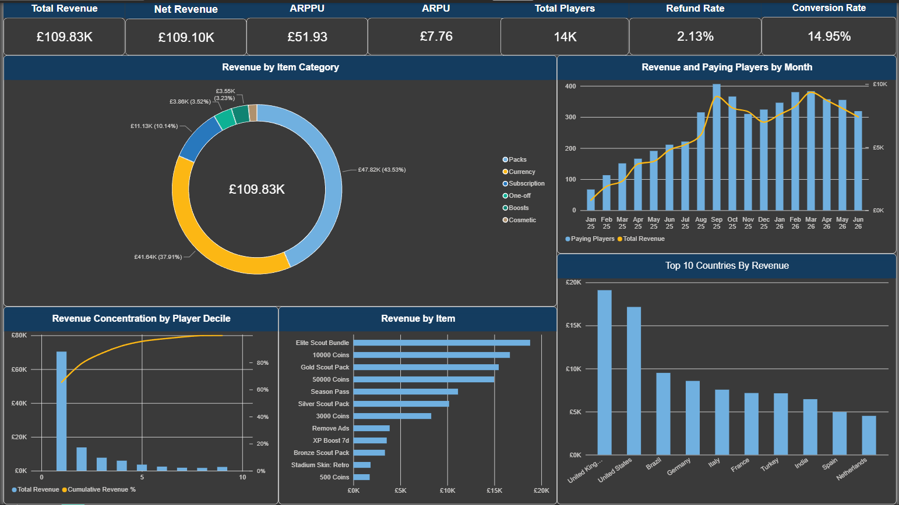

# Mobile Game Revenue Analysis

Power BI analysis of 18 months of in-app purchase data for **Tactic Royale**, a fictional free-to-play mobile football management game. 

**Period:** January 2025 – June 2026  
**Scope:** 14,151 players, 16,296 transactions, £109,834 gross revenue  
**Tools:** Power BI (Power Query / M, DAX)

> The dataset is synthetic and generated for this project. It does not represent any real product.

---

## The dashboard



One page: seven KPI cards across the top, revenue split by item category, revenue and paying players on a shared monthly axis, a Pareto curve of revenue concentration by player decile, revenue by individual item, and the top ten countries.

The two charts that carry the argument are the monthly dual-axis view — where revenue and paying players rise together, showing growth comes from volume rather than depth — and the Pareto curve, whose near-vertical first decile makes the concentration visible at a glance.

---

## Headline metrics

| Metric | Value |
|---|---|
| Gross revenue | £109,834 |
| Net revenue (after refunds) | £107,318 |
| Paying players | 2,115 |
| Conversion rate | 14.95% |
| ARPU | £7.76 |
| ARPPU | £51.93 |
| Refund rate | 2.13% |

**Note on conversion rate:** 14.95% is far above the 2–5% typical of free-to-play mobile titles. This is a property of the synthetic data rather than a finding, and the absolute figure should not be read as realistic. Relative comparisons within the dataset remain valid.

---

## Findings

### Growth came from more payers, not bigger spenders

Monthly revenue grew from £796 in January 2025 to a peak of £9,351 in March 2026 — roughly 12x over 18 months.

Plotting revenue against paying player count shows the two series tracking closely. Paying players rose from 67 to 383 across the same period, while monthly ARPPU moved from £11.88 to £24.42. Both contributed, but the dominant driver is acquisition and conversion volume rather than deepening monetisation of the existing base.

This distinction matters for where investment goes. Revenue growth built on player volume is vulnerable to acquisition costs rising or channel performance degrading; growth built on increasing spend per player is more durable. On this evidence the product is in the former position.

### Revenue is concentrated in progression, not personalisation

| Category | Revenue | Share |
|---|---|---|
| Packs | £47,816 | 43.5% |
| Currency | £41,643 | 37.9% |
| Subscription | £11,133 | 10.1% |
| One-off | £3,862 | 3.5% |
| Boosts | £3,550 | 3.2% |
| Cosmetic | £1,831 | 1.7% |

Packs and Currency together account for 81.4% of revenue. Cosmetics generate under 2%.

Players are paying to progress faster, not to customise. The four highest-earning individual items are all progression purchases — Elite Scout Bundle (£18,807), 10000 Coins (£16,654), Gold Scout Pack (£15,467) and 50000 Coins (£14,970).

That has a clear product implication: cosmetic content is unlikely to repay development investment at current levels, while the top of the pack and currency ranges is where revenue responds.

### Revenue is heavily concentrated among a small group of players

The top 10% of paying players generate **64.5%** of revenue. The top 1% generate 13.2%.

This is the expected shape for free-to-play, but the degree of concentration has practical consequences. Roughly 210 players account for two thirds of income, which means revenue is more exposed to churn in that group than aggregate metrics suggest. ARPU treated as an average across all players obscures this entirely — it is the concentration curve, not the mean, that describes the actual revenue base.

### Geographic distribution

| Country | Revenue |
|---|---|
| United Kingdom | £17,316 |
| United States | £15,993 |
| Brazil | £9,503 |
| Germany | £8,121 |
| Italy | £7,553 |
| France | £7,162 |

The UK and US together contribute 30% of revenue. Brazil ranks third by revenue despite lower average spend, on player volume.

---

## Methodology

### Cleaning (Power Query)

The source data carried the problems typical of client-side telemetry and billing systems feeding a shared warehouse.

| Issue | Volume | Treatment |
|---|---|---|
| Non-production accounts (QA, internal test, emulator) | 140 accounts | Filtered at load |
| Duplicate transaction records (billing retry double-write) | 209 rows | `Table.Distinct` on `transaction_id` |
| Currency symbols and codes embedded in `amount` (`$3.78`, `2.52 USD`) | 2,060 rows | Stripped with `Text.Remove`, converted to number |
| `amount_gbp` null for non-GBP transactions | 4,308 rows (26%) | Replaced with own conversion from `amount` and `currency` |
| `status` casing drift (`completed` / `COMPLETED`) | 971 rows | Lowercased |
| Refunds inconsistently signed — 40% negative, 60% positive | 91 rows negative | Standardised to positive, separated by status in the measure layer |
| Mixed timestamp formats in `session_start` (three formats) | 86,952 rows | Normalised with `DateTime.FromText` and `Culture="en-GB"` |

### Decisions worth explaining

**Test accounts were filtered at load, not excluded in measures.** Excluding them inside individual measures would leave them counted everywhere else — player totals, session charts, the country breakdown. Filtering in Power Query removes them from the model so every downstream visual is correct by default. This changed the headline player count by 140 and the conversion rate by roughly 0.15 points.

**Currency conversion was rebuilt rather than relying on the source column.** The supplied `amount_gbp` is populated on GBP transactions and about half of others, leaving 26% of rows null. Summing it directly understates revenue by roughly a quarter. A calculated column converts every row from `amount` using the transaction currency, and the original column was removed from the model to prevent accidental use. Fixed rates are applied (1 GBP = 1.27 USD = 1.18 EUR); production reporting would use the rate at transaction date.

**Refunds were standardised to positive and separated in the measure layer.** The source represented refunds two ways — negative `amount_gbp` on some rows, positive with a `refunded` status on others — which makes the column unsummable. Standardising the sign fixes that, but creates a second problem: refunds and failed payments become indistinguishable from completed sales in a naive sum. Every revenue measure therefore filters on `status = "completed"`, with refunds reported separately as their own value and rate.

**Duplicate transactions inflated revenue by 1.3%.** Before deduplication, gross revenue read £111,190 against a true £109,834, with the same proportional error propagating into ARPU, ARPPU and refund rate. The distortion is small enough to pass unnoticed, which is precisely why the uniqueness check matters.

**`Culture="en-GB"` on date parsing.** 27,646 timestamps arrived as `dd/mm/yyyy`. Of these, 16,955 have a day number above 12 and would throw a visible error under US parsing — but the remaining 10,691 would parse silently wrong, swapping day and month. Errors are recoverable; silent transposition is not.

### Data model

Star schema with two fact tables at different grains.

- `transactions` — fact, one row per purchase attempt
- `sessions` — fact, one row per gameplay session
- `players` — dimension
- `items` — product catalogue
- `Date Table` — generated with `CALENDAR()`, marked as a date table

Both fact tables relate to `players` and to `Date Table`, and not to each other. This is what allows revenue and player activity to share a time axis without double-counting; flattening the two facts into a single table would multiply transaction rows by session rows.

`Month Year` is set to sort by a `yyyy-mm` column so time axes order chronologically rather than alphabetically.

### Core measures

```dax
Total Revenue =
CALCULATE( SUM( transactions[amount_gbp_calc] ), transactions[status] = "completed" )

Refunded Value =
CALCULATE( SUM( transactions[amount_gbp_calc] ), transactions[status] = "refunded" )

Net Revenue = [Total Revenue] - [Refunded Value]

Paying Players =
CALCULATE( DISTINCTCOUNT( transactions[player_id] ), transactions[status] = "completed" )

Total Players = COUNTROWS( players )

Conversion Rate % = DIVIDE( [Paying Players], [Total Players] )

ARPU  = DIVIDE( [Total Revenue], [Total Players] )
ARPPU = DIVIDE( [Total Revenue], [Paying Players] )

Refund Rate % =
DIVIDE(
    CALCULATE( COUNTROWS( transactions ), transactions[status] = "refunded" ),
    CALCULATE( COUNTROWS( transactions ), transactions[status] IN { "completed", "refunded" } )
)
```

Failed payments are excluded from the refund rate denominator — a payment that never completed was never a refund candidate.

### Revenue concentration (Pareto)

Power BI has no native Pareto chart. The curve was built from a line-and-clustered-column visual with a decile dimension and a running total:

```dax
Cumulative Revenue % =
VAR CurrentDecile = MAX( 'Player Revenue'[Revenue Decile] )
VAR RunningTotal =
    CALCULATE(
        SUM( 'Player Revenue'[Revenue] ),
        ALL( 'Player Revenue' ),
        'Player Revenue'[Revenue Decile] <= CurrentDecile
    )
VAR GrandTotal = CALCULATE( SUM( 'Player Revenue'[Revenue] ), ALL( 'Player Revenue' ) )
RETURN DIVIDE( RunningTotal, GrandTotal )
```

The secondary axis is set to 0–100% rather than auto-scaling. On an auto axis the curve appears to climb gradually from a low base; the true shape is a near-vertical jump to 64.5% at the first decile followed by a long flat tail, and the auto-scaled version understates the concentration.

---

## Definitions

**ARPU** — average revenue per user, across all players including non-payers.  
**ARPPU** — average revenue per paying user. The gap between this and ARPU is the monetisation story.  
**Conversion rate** — share of players who complete at least one purchase.  
**Refund rate** — refunded transactions as a share of transactions that completed or were refunded.  
**Revenue decile** — paying players ranked by lifetime spend and split into ten equal groups.

---

## Repository contents

| File | Description |
|---|---|
| `Game Dashboard.pbix` | Power BI report, including all Power Query steps and DAX measures |
| `Mobile-Game-Revenue-Analysis.png` | Screenshot of the report page |

---

## Possible extensions

**Cohort retention.** The session data supports D1/D7/D30 retention by signup cohort, channel and platform. Pairing retention with revenue would give lifetime value by cohort, which is the metric that makes acquisition spend decisions possible.

**Acquisition efficiency.** Marketing spend by channel is available in the source data, supporting CAC and payback analysis. Two campaign bursts are visible in the acquisition record and burst-acquired players appear to behave differently from baseline — quantifying that difference is the most commercially useful question the dataset can answer.

**Crash impact on monetisation.** Session-level crash flags and app version are available. Testing whether crash exposure predicts churn or reduced spend would connect technical health to revenue.
